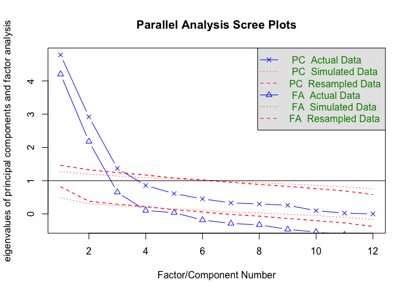
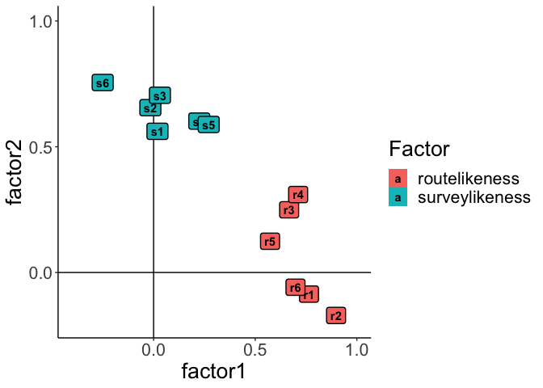

Data analysis for: Distinguishing Sketch Map Types: A Flexible
Feature-Based Classification
================
Jakub Krukar (<krukar@uni-muenster.de> \| <http://krukar.staff.ifgi.de>)
(paper with: Stefan Muenzer, Lucas Loerch, Vanessa Joy Anacta, Stefan
Fuest, Angela Schwering)
28.09.2021

# Preliminaries

Loading data

``` r
df <- read.csv(here("data", "AlbanyMuensterMannheim.csv"))
df$city <- str_replace(df$city, "Albany.*", "Albany")
df$city <- str_replace(df$city, "1", "Muenster")
df$city <- str_replace(df$city, "2", "Mannheim")

df2 <- read_excel(here("data", "fictional.xlsx"), na = "empty")
df2 <- df2 %>% select(part.ID, R1:R6, S1:S6) %>% rename(city=part.ID, s1=S1, s2=S2, s3=S3, s4=S4, s5=S5, s6=S6, r1=R1, r2=R2, r3=R3, r4=R4, r5=R5, r6=R6)
df2$city <- str_replace_all(df2$city, fixed(" "), "")
df2$city <- paste0("fictional", df2$city)
df <- bind_rows(df, df2)

df$r1 <- as.ordered(df$r1)
df$r2 <- as.ordered(df$r2)
df$r3 <- as.ordered(df$r3)
df$r4 <- as.ordered(df$r4)
df$r5 <- as.ordered(df$r5)
df$r6 <- as.ordered(df$r6)
df$s1 <- as.ordered(df$s1)
df$s2 <- as.ordered(df$s2)
df$s3 <- as.ordered(df$s3)
df$s4 <- as.ordered(df$s4)
df$s5 <- as.ordered(df$s5)
df$s6 <- as.ordered(df$s6)
df$city <- as.factor(df$city)
rm(df2)

df2 <- select(df, -city)
df2$r1 <- as.numeric(as.character(df$r1))
df2$r2 <- as.numeric(as.character(df$r2))
df2$r3 <- as.numeric(as.character(df$r3))
df2$r4 <- as.numeric(as.character(df$r4))
df2$r5 <- as.numeric(as.character(df$r5))
df2$r6 <- as.numeric(as.character(df$r6))
df2$s1 <- as.numeric(as.character(df$s1))
df2$s2 <- as.numeric(as.character(df$s2))
df2$s3 <- as.numeric(as.character(df$s3))
df2$s4 <- as.numeric(as.character(df$s4))
df2$s5 <- as.numeric(as.character(df$s5))
df2$s6 <- as.numeric(as.character(df$s6))

df.reliability <- read_excel(here("data", "reliability_RS.xlsx"))
```

**Section numbers below refer to corresponding sections in the published
manuscript.**

# 4.1 Data

> Table 2

``` r
select(df2, r1:s6) %>% summarise_all(funs(sum)) %>% 
  kable(digits = 3, caption="Number of maps (out of 460) containing each criterion.")
```

|  r1 |  r2 |  r3 |  r4 |  r5 |  r6 |  s1 |  s2 |  s3 |  s4 |  s5 |  s6 |
|----:|----:|----:|----:|----:|----:|----:|----:|----:|----:|----:|----:|
| 352 | 366 | 171 | 215 | 253 | 235 | 129 | 210 | 213 | 172 | 255 | 253 |

Number of maps (out of 460) containing each criterion.

------------------------------------------------------------------------

# 4.2 Inter-rater Reliability

> Intra-class correlations (ICCs) were in the “good” range, ICC = 0.68
> for the *route-likeness* dimension and ICC = 0.61 for the
> *survey-likeness* dimension.

``` r
# rationale
# https://www.theanalysisfactor.com/inter-rater-reliability-a-few-good-resources/

##### HISTOGRAMS:
# hist(df.reliability$R_sum_Rating1)
# hist(df.reliability$S_sum_Rating1)

# .r stands for routelikeness and .s stands for surveylikeness
df.reliability.r <- df.reliability %>% select(R_sum_Rating1, R_sum_Rating2, R_sum_Rating3)
df.reliability.r <- df.reliability.r[-11,] # this removes one case that was complete in .r but had NA in .s -> makes the number of sketch maps equal
df.reliability.s <- df.reliability %>% select(S_sum_Rating1, S_sum_Rating2, S_sum_Rating3)

# ICC for route-likeness:
icc.r <- icc(df.reliability.r, model="twoway", type="agreement", unit="average")
# ICC for survey-likeness:
icc.s <- icc(df.reliability.s, model="twoway", type="agreement", unit="average")

# results are in the 'good' range:
# https://www.ncbi.nlm.nih.gov/pmc/articles/PMC3402032/
```

Calculated ICC for route-likeness: 0.68

Calculated ICC for survey-likeness: 0.6

------------------------------------------------------------------------

# 4.3 Results

> Table 3

``` r
tetrachoric(df2)$rho %>% 
  kable(digits = 2, caption="Tetrachoric correlations between individual items.")
```

|     |    r1 |    r2 |   r3 |   r4 |    r5 |    r6 |    s1 |    s2 |    s3 |    s4 |   s5 |    s6 |
|:----|------:|------:|-----:|-----:|------:|------:|------:|------:|------:|------:|-----:|------:|
| r1  |  1.00 |  0.93 | 0.52 | 0.68 |  0.39 |  0.50 |  0.03 | -0.05 |  0.02 |  0.36 | 0.21 | -0.20 |
| r2  |  0.93 |  1.00 | 0.58 | 0.75 |  0.51 |  0.64 | -0.03 | -0.06 | -0.04 |  0.30 | 0.21 | -0.31 |
| r3  |  0.52 |  0.58 | 1.00 | 0.69 |  0.43 |  0.51 |  0.07 |  0.17 |  0.24 |  0.47 | 0.51 |  0.17 |
| r4  |  0.68 |  0.75 | 0.69 | 1.00 |  0.50 |  0.61 |  0.23 |  0.24 |  0.39 |  0.55 | 0.53 |  0.23 |
| r5  |  0.39 |  0.51 | 0.43 | 0.50 |  1.00 |  0.69 |  0.18 |  0.31 |  0.32 |  0.14 | 0.15 | -0.02 |
| r6  |  0.50 |  0.64 | 0.51 | 0.61 |  0.69 |  1.00 |  0.20 |  0.15 |  0.03 | -0.05 | 0.29 | -0.29 |
| s1  |  0.03 | -0.03 | 0.07 | 0.23 |  0.18 |  0.20 |  1.00 |  0.37 |  0.56 |  0.18 | 0.46 |  0.21 |
| s2  | -0.05 | -0.06 | 0.17 | 0.24 |  0.31 |  0.15 |  0.37 |  1.00 |  0.53 |  0.38 | 0.31 |  0.48 |
| s3  |  0.02 | -0.04 | 0.24 | 0.39 |  0.32 |  0.03 |  0.56 |  0.53 |  1.00 |  0.44 | 0.56 |  0.52 |
| s4  |  0.36 |  0.30 | 0.47 | 0.55 |  0.14 | -0.05 |  0.18 |  0.38 |  0.44 |  1.00 | 0.65 |  0.72 |
| s5  |  0.21 |  0.21 | 0.51 | 0.53 |  0.15 |  0.29 |  0.46 |  0.31 |  0.56 |  0.65 | 1.00 |  0.40 |
| s6  | -0.20 | -0.31 | 0.17 | 0.23 | -0.02 | -0.29 |  0.21 |  0.48 |  0.52 |  0.72 | 0.40 |  1.00 |

Tetrachoric correlations between individual items.

------------------------------------------------------------------------

> A scree plot inspection of Eigenvalues indicated that the data coming
> from twelve criteria might be described best using a three-factor
> solution…

``` r
fa.parallel(df2, fm="wls", cor="tet")
```

<!-- -->

    ## Parallel analysis suggests that the number of factors =  3  and the number of components =  3

------------------------------------------------------------------------

> On theory-motivated grounds, we performed factor analysis restricted
> to two factors…

``` r
z <- fa(df2,2, fm="wls", cor="tet")
```

``` r
z
```

    ## Factor Analysis using method =  wls
    ## Call: fa(r = df2, nfactors = 2, fm = "wls", cor = "tet")
    ## Standardized loadings (pattern matrix) based upon correlation matrix
    ##     WLS1  WLS2   h2   u2 com
    ## r1  0.76 -0.09 0.57 0.43 1.0
    ## r2  0.90 -0.17 0.78 0.22 1.1
    ## r3  0.67  0.25 0.56 0.44 1.3
    ## r4  0.71  0.31 0.68 0.32 1.4
    ## r5  0.57  0.12 0.37 0.63 1.1
    ## r6  0.70 -0.06 0.48 0.52 1.0
    ## s1  0.02  0.56 0.32 0.68 1.0
    ## s2 -0.02  0.66 0.43 0.57 1.0
    ## s3  0.03  0.70 0.51 0.49 1.0
    ## s4  0.22  0.60 0.46 0.54 1.3
    ## s5  0.27  0.59 0.48 0.52 1.4
    ## s6 -0.25  0.76 0.57 0.43 1.2
    ## 
    ##                       WLS1 WLS2
    ## SS loadings           3.40 2.79
    ## Proportion Var        0.28 0.23
    ## Cumulative Var        0.28 0.52
    ## Proportion Explained  0.55 0.45
    ## Cumulative Proportion 0.55 1.00
    ## 
    ##  With factor correlations of 
    ##      WLS1 WLS2
    ## WLS1 1.00 0.17
    ## WLS2 0.17 1.00
    ## 
    ## Mean item complexity =  1.1
    ## Test of the hypothesis that 2 factors are sufficient.
    ## 
    ## The degrees of freedom for the null model are  66  and the objective function was  31.41 with Chi Square of  14264.45
    ## The degrees of freedom for the model are 43  and the objective function was  24.96 
    ## 
    ## The root mean square of the residuals (RMSR) is  0.11 
    ## The df corrected root mean square of the residuals is  0.14 
    ## 
    ## The harmonic number of observations is  460 with the empirical chi square  780.19  with prob <  0.00000000000000000000000000000000000000000000000000000000000000000000000000000000000000000000000000000000000000000000000000000000000000048 
    ## The total number of observations was  460  with Likelihood Chi Square =  11302.54  with prob <  0 
    ## 
    ## Tucker Lewis Index of factoring reliability =  -0.221
    ## RMSEA index =  0.754  and the 90 % confidence intervals are  0.744 0.767
    ## BIC =  11038.89
    ## Fit based upon off diagonal values = 0.93

------------------------------------------------------------------------

> Table 4

**Comment: The paper reported incorrect factor loadings.** (This mistake
doesn’t affect other results reported in the paper.)

``` r
unclass(z$loadings) %>% 
  kable(digits = 3, caption="Standardised Factor Loadings")
```

|     |   WLS1 |   WLS2 |
|:----|-------:|-------:|
| r1  |  0.764 | -0.086 |
| r2  |  0.898 | -0.171 |
| r3  |  0.667 |  0.249 |
| r4  |  0.711 |  0.310 |
| r5  |  0.573 |  0.124 |
| r6  |  0.698 | -0.059 |
| s1  |  0.019 |  0.561 |
| s2  | -0.016 |  0.655 |
| s3  |  0.031 |  0.705 |
| s4  |  0.225 |  0.602 |
| s5  |  0.271 |  0.589 |
| s6  | -0.251 |  0.755 |

Standardised Factor Loadings

------------------------------------------------------------------------

> The correlation between the two factors equals 0.14

``` r
round(z$crms,2)
```

    ## [1] 0.14

------------------------------------------------------------------------

> Figure 2

``` r
ploting <- as.data.frame(unclass(z$loadings))
ploting <- rename(ploting, factor1=WLS1, factor2=WLS2)
ploting$criterion <- rownames(ploting)
ploting$Factor <- ifelse(str_detect(ploting$criterion, "r"), "routelikeness", "surveylikeness")

ggplot(aes(x=factor1, y=factor2, label=criterion, fill=Factor), data=ploting) + theme_classic() + theme(text = element_text(size=20)) +
  geom_vline(xintercept = 0) + geom_hline(yintercept = 0) + geom_label(label.size = 0.5, fontface = "bold") + 
   scale_y_continuous(breaks=seq(0,1,0.5), limits=c(-0.2,1)) + scale_x_continuous(breaks=seq(0,1,0.5), limits=c(-0.4,1))
```

<!-- -->

------------------------------------------------------------------------

> Guttman’s Lambda 6 was 0.82 for the route-likeness dimension and 0.73
> for the survey-likeness dimension.

``` r
keys.list <- list(route= c("r1","r2","r3","r4","r5","r6"),
                  survey=c("s1","s2","s3","s4","s5","s6"))
reliability <- scoreItems(keys.list,df2)
```

Calculated Guttman’s Lambda 6 reliability of route-likeness: 0.82

Calculated Guttman’s Lambda 6 reliability of survey-likeness: 0.73

------------------------------------------------------------------------

# 4.4 Discussion

> In our dataset of 460 sketches, 327 scored at least one point on both
> dimensions

``` r
df2 %>% mutate(r=r1+r2+r3+r4+r5+r6, s=s1+s2+s3+s4+s5+s6) %>% filter(r>0, s>0) %>% nrow()
```

    ## [1] 327

------------------------------------------------------------------------

> Nevertheless, more discrete categorizations can be derived, if needed.
> For instance, it is possible to calculate the mean route-likeness and
> mean survey-likeness scores and classify sketch maps into four
> relative categories, depending on their score below or above the two
> means (Fig. 1 contains some examples). Performing this operation on
> our 460 sketches resulted in 116 maps falling into the “low - low”
> category, 84 sketches in the “low route - high survey” category, 95
> sketches in the “high route - low survey” category, and 165 in the
> “high - high” category. The spread of these numbers highlights the
> fact that the two-dimensional scoring approach can capture the
> diversity of sketch maps and does not result in a disproportionally
> large number of “poor” maps.

``` r
sum <- df2 %>% mutate(r=r1+r2+r3+r4+r5+r6, s=s1+s2+s3+s4+s5+s6)
meanR <- mean(sum$r)
meanS <- mean(sum$s)
sum <- sum %>% mutate(cat = case_when(
  r < meanR & s < meanS ~ "lowR-lowS",
  r < meanR & s > meanS ~ "lowR-highS",
  r > meanR & s < meanS ~ "highR-lowS",
  r > meanR & s > meanS ~ "highR-highS"))
table(sum$cat)
```

    ## 
    ## highR-highS  highR-lowS  lowR-highS   lowR-lowS 
    ##         165          95          84         116
